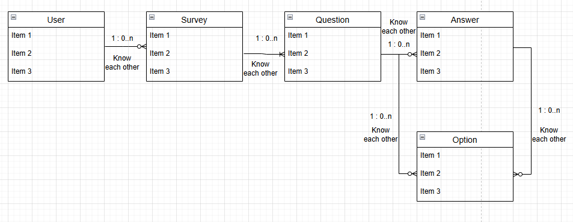

## 2025.02.18

### 프로젝트 회고
-----
- **"1이 N을 알 수 있음"** → **@OneToMany** 사용 (컬렉션 형태로 N을 참조)
- **"N이 1을 알 수 있음"** → **@ManyToOne** 사용 (외래키로 1을 참조)

- 테이블 관계
    - 한 명의 유저는 여러 개의 설문 조사를 소유할 수 있다.
    - 한 개의 설문조사는 여러 개의 질문으로 구성되어 있다.
    - 한 개의 질문은 여러 개의 답변으로 구성될 수 있다.(0개 이상)
    - 한 개의 질문에는 여러 개의 선택지가 주어질 수 있다.  

    
- 엔티티간의 관계를 고려했을 때 상위 엔티티부터 구현해야할 지, 하위 엔티티부터 구현해야할 지 고민을 했었는데, **의존성 해결**을 위해서 **상위 엔티티부터 구현**해야 한다고 판단
- 엔티티에서 외래키가 객체일 경우에는 해당 객체를 먼저 조회하고, 해당 객체를 넘겨주는 방식을 사용
- 엔티티 수정할 때에는, 엔티티 클래스에 엔티티의 속성을 업데이트하는 업데이트 메서드를 따로 작성하는 것을 선호

